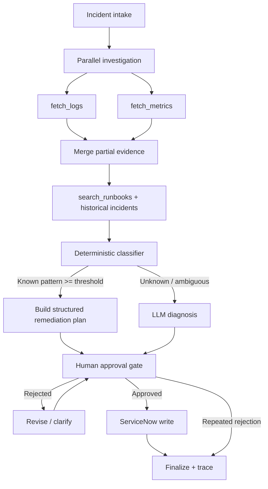

# Architecture

## State and merge strategy
- Logs and metrics are independent branches and write to `logs_result` / `metrics_result`.
- Branch errors are preserved in `logs_error` / `metrics_error`.
- One successful branch is enough to continue with partial evidence.
- If both fail, the workflow asks for clarification.
- ServiceNow writes are blocked unless the approval flag is true at the graph, schema and function layers.
